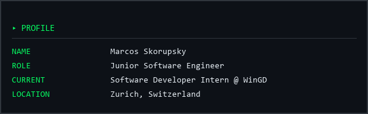
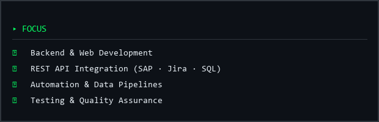
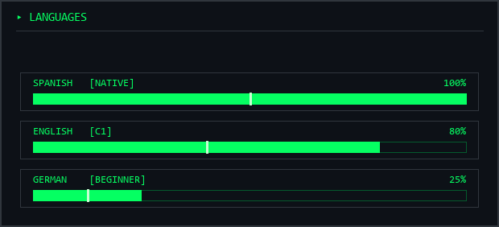
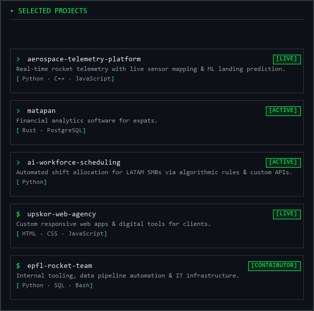

 

<code>[ SYSTEM INITIALIZED ] :: ACCESS GRANTED</code>

 

<b>Marcos Skorupsky</b> &nbsp;//&nbsp; Zurich, CH &nbsp;//&nbsp; Junior Software Engineer

 

 

<!-- ============================================================
  TWO-COLUMN LAYOUT
  IMPORTANT: keep NO blank lines and no 4+-space indentation between
  <table> and </table> below. GitHub's CommonMark parser treats a raw
  <table> as an HTML block that ENDS at the first blank line; anything
  after that blank line that is indented 4+ spaces is re-parsed as an
  INDENTED CODE BLOCK. That is what turned the left column into flat,
  unstyled source text (diagnosed 2026-09-23, see _render_before.html).
  The card design (bg #0d1117, 1px #30363d border, #05FF62 monospace
  header) is baked into the card images because inline style="" on the
  card divs was not verifiable as surviving this render path.
============================================================ -->
<table>
<tr>
<td width="55%" valign="top">

 

 

</td>
<td width="45%" valign="top">

  

  

  

</td>
</tr>
</table>

 

<!-- TECH STACK. Kept as the original styled 
s (not a <table>): div
     inline styles (background, border, border-radius, padding, color,
     font-*, line-height, letter-spacing, margin) are on GitHub's
     documented inline-style allowlist, and this section is top-level
     (outside the two-column table), so it was never affected by the
     blank-line/code-block bug. -->

  
▸ TECH STACK

  
// LANGUAGES

  
  
// WEB & BACKEND

  
  
// DATABASES

  
  
// DATA & AI

  
  
// TESTING & QA

  
  
// TOOLS & PLATFORMS

  
  
// ENTERPRISE

 

<!-- SELECTED PROJECTS — rendered as a card image (see note above the
     two-column table) -->

 

<!-- FOOTER -->

<code style="color:#05FF62;">> There is no spoon. Free your mind.</code>

  

