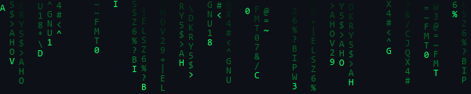
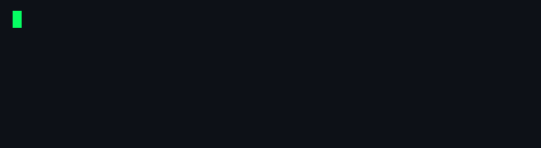
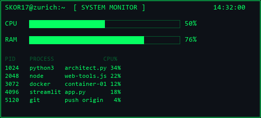

 
<code>[ SYSTEM INITIALIZED ] :: ACCESS GRANTED</code>
 
<b>Marcos Skorupsky</b> &nbsp;//&nbsp; Zurich, CH &nbsp;//&nbsp; Junior Software Engineer

<table>
<tr>
<td width="55%" valign="top">

▸ PROFILE

<table style="font-family:monospace; font-size:14px; line-height:1.7;">
<tr><td style="color:#05FF62; padding-right:18px; white-space:nowrap;">NAME</td><td>Marcos Skorupsky</td></tr>
<tr><td style="color:#05FF62; padding-right:18px; white-space:nowrap;">ROLE</td><td>Junior Software Engineer</td></tr>
<tr><td style="color:#05FF62; padding-right:18px; white-space:nowrap;">CURRENT</td><td>Software Developer Intern @ WinGD</td></tr>
<tr><td style="color:#05FF62; padding-right:18px; white-space:nowrap;">LOCATION</td><td>Zurich, Switzerland</td></tr>
<tr><td style="color:#05FF62; padding-right:18px; white-space:nowrap;">INDUSTRY</td><td>Maritime</td></tr>
<tr><td style="color:#05FF62; padding-right:18px; white-space:nowrap;">STATUS</td><td>EU Citizen · Open to Relocate</td></tr>
</table>

▸ FOCUS

▹ Backend &amp; Web Development 
▹ REST API Integration (SAP · Jira · SQL) 
▹ Automation &amp; Data Pipelines 
▹ Testing &amp; Quality Assurance

▸ LANGUAGES

<table style="font-family:monospace; font-size:14px; line-height:1.8;">
<tr><td style="padding-right:18px;">Spanish</td><td style="color:#05FF62;">Native</td></tr>
<tr><td style="padding-right:18px;">English</td><td style="color:#05FF62;">C1 · Cambridge</td></tr>
<tr><td style="padding-right:18px;">German</td><td style="color:#05FF62;">Beginner</td></tr>
<tr><td style="padding-right:18px;">Norwegian</td><td style="color:#05FF62;">Beginner</td></tr>
</table>

</td>
<td width="45%" valign="top">

  

  

  

</td>
</tr>
</table>

▸ TECH STACK

// LANGUAGES

  

// WEB &amp; BACKEND

  

// DATABASES

  

// DATA &amp; AI

  

// TESTING &amp; QA

  

// TOOLS &amp; PLATFORMS

  

// ENTERPRISE

▸ SELECTED PROJECTS

▹ <b>Aerospace Telemetry Platform</b> — Real-time rocket telemetry with live sensor mapping &amp; ML landing prediction (Python · C++ · JS) 
▹ <b>Matapan</b> — Financial analytics software for expats (Rust · PostgreSQL) 
▹ <b>AI Workforce Scheduling</b> — Automated shift allocation for LATAM SMBs via algorithmic rules &amp; custom APIs (Python) 
▹ <b>UpSkor Web Agency</b> — Custom responsive web apps &amp; digital tools for clients (HTML · CSS · JS) 
▹ <b>EPFL Rocket Team</b> — Internal tooling, data pipeline automation &amp; IT infrastructure (Contributor)

<code style="color:#05FF62;">&gt; There is no spoon. Free your mind.</code>
  

