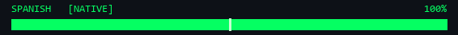
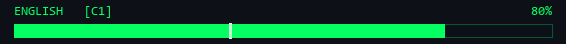
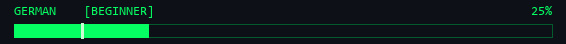

 

<code>[ SYSTEM INITIALIZED ] :: ACCESS GRANTED</code>

 

<b>Marcos Skorupsky</b> &nbsp;//&nbsp; Zurich, CH &nbsp;//&nbsp; Junior Software Engineer

 

  

 

<table>
  <tr>
    <td width="55%" valign="top">

      <!-- PROFILE -->
      

        
▸ PROFILE

        <table style="font-family:monospace; font-size:14px; line-height:1.7;">
          <tr><td style="color:#05FF62; padding-right:18px; white-space:nowrap;">NAME</td><td>Marcos Skorupsky</td></tr>
          <tr><td style="color:#05FF62; padding-right:18px; white-space:nowrap;">ROLE</td><td>Junior Software Engineer</td></tr>
          <tr><td style="color:#05FF62; padding-right:18px; white-space:nowrap;">CURRENT</td><td>Software Developer Intern @ WinGD</td></tr>
          <tr><td style="color:#05FF62; padding-right:18px; white-space:nowrap;">LOCATION</td><td>Zurich, Switzerland</td></tr>
        </table>
      

      <!-- FOCUS -->
      

        
▸ FOCUS

        

          ▹ Backend & Web Development 
          ▹ REST API Integration (SAP · Jira · SQL) 
          ▹ Automation & Data Pipelines 
          ▹ Testing & Quality Assurance
        

      

      <!-- LANGUAGES -->
      

        
▸ LANGUAGES

        

          
           
          
           
          
        

      

    </td>
    <td width="45%" valign="top">

      
        
      
        
      
        
      

    </td>
  </tr>
</table>

 

<!-- TECH STACK -->

  
▸ TECH STACK

  
// LANGUAGES

  
  
  
  
    

  
// WEB & BACKEND

  
  
  
  
    

  
// DATABASES

  
  
    

  
// DATA & AI

  
  
  
    

  
// TESTING & QA

  
  
    

  
// TOOLS & PLATFORMS

  
  
  
  
  
  
    

  
// ENTERPRISE

  
  
  
  
  
  

<!-- PROJECTS -->

  
▸ SELECTED PROJECTS

  

    <table style="border:1px solid #30363d; border-radius:8px; margin:0 0 12px 0; width:100%;"><tr><td style="background:#0d1117; border-radius:8px; padding:14px; line-height:1.7;">
      
> <b style="color:#e6edf3;">aerospace-telemetry-platform</b> [LIVE]

      
Real-time rocket telemetry with live sensor mapping & ML landing prediction.

      
[Python · C++ · JavaScript]

    </td></tr></table>

    <table style="border:1px solid #30363d; border-radius:8px; margin:0 0 12px 0; width:100%;"><tr><td style="background:#0d1117; border-radius:8px; padding:14px; line-height:1.7;">
      
> <b style="color:#e6edf3;">matapan</b> [ACTIVE]

      
Financial analytics software for expats.

      
[Rust · PostgreSQL]

    </td></tr></table>

    <table style="border:1px solid #30363d; border-radius:8px; margin:0 0 12px 0; width:100%;"><tr><td style="background:#0d1117; border-radius:8px; padding:14px; line-height:1.7;">
      
> <b style="color:#e6edf3;">ai-workforce-scheduling</b> [ACTIVE]

      
Automated shift allocation for LATAM SMBs via algorithmic rules & custom APIs.

      
[Python]

    </td></tr></table>

    <table style="border:1px solid #30363d; border-radius:8px; margin:0 0 12px 0; width:100%;"><tr><td style="background:#0d1117; border-radius:8px; padding:14px; line-height:1.7;">
      
$ <b style="color:#e6edf3;">upskor-web-agency</b> [LIVE]

      
Custom responsive web apps & digital tools for clients.

      
[HTML · CSS · JavaScript]

    </td></tr></table>

    <table style="border:1px solid #30363d; border-radius:8px; margin:0 0 0 0; width:100%;"><tr><td style="background:#0d1117; border-radius:8px; padding:14px; line-height:1.7;">
      
$ <b style="color:#e6edf3;">epfl-rocket-team</b> [CONTRIBUTOR]

      
Internal tooling, data pipeline automation & IT infrastructure.

      
[Python · SQL · Bash]

    </td></tr></table>

  

<!-- FOOTER -->

<code style="color:#05FF62;">> There is no spoon. Free your mind.</code>

  

