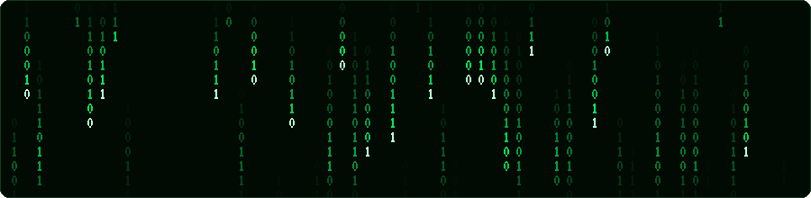
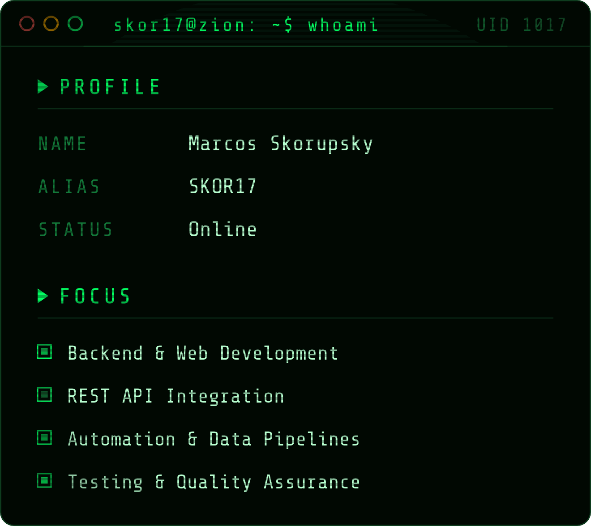
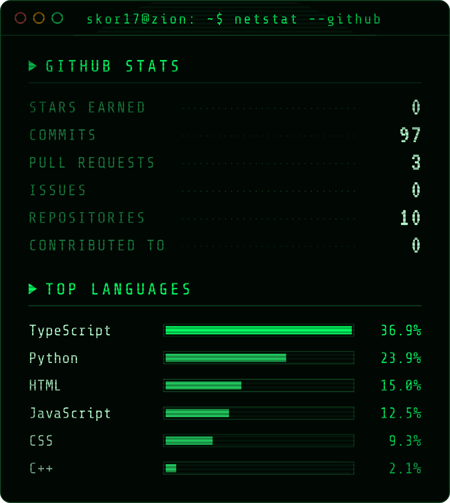
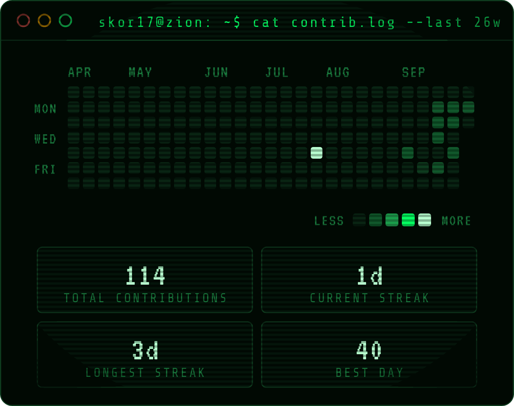
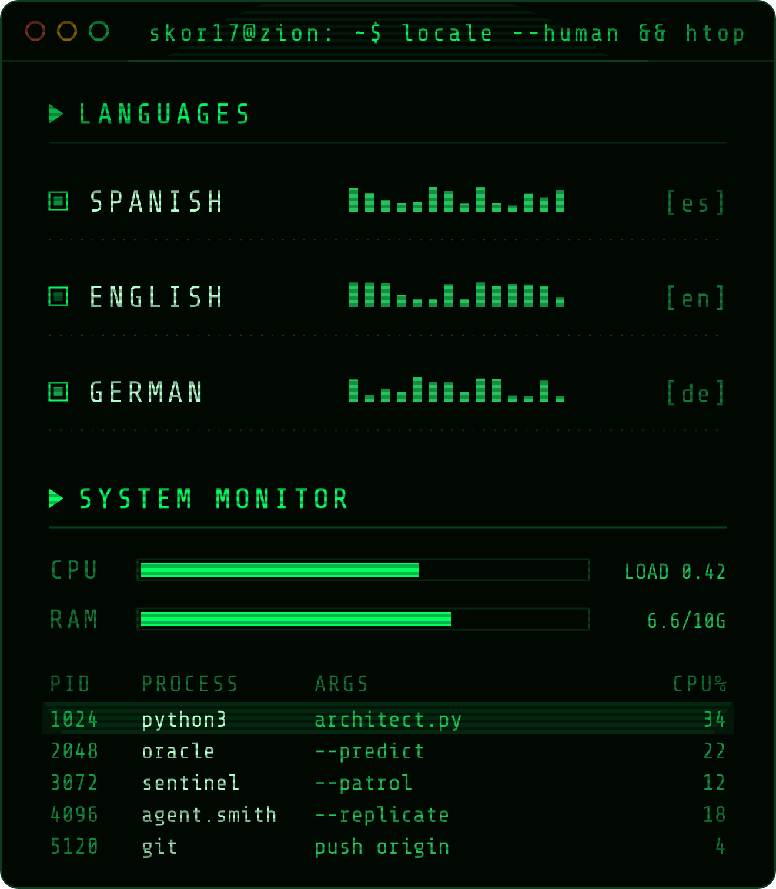
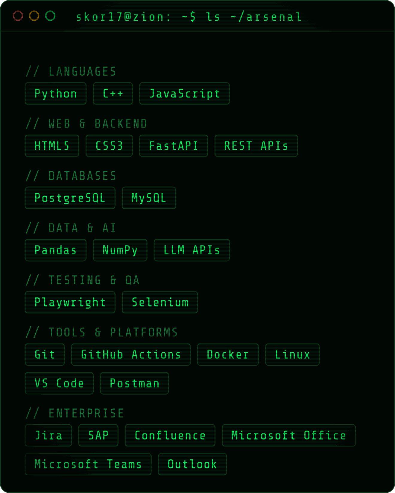

<!--
  Generated by scripts/build.py from profile.toml: edit profile.toml and push,
  the matrix-sync workflow rebuilds the images and refreshes the GitHub stats daily.

  Only plain images with relative paths: they show on every browser and in the
  GitHub mobile apps. rain.gif is the one animation (GIF plays everywhere); the
  cards are PNG. Cards use a narrow layout so they stay readable on a phone:
  520px wide on desktop, shrunk to the screen width on mobile.
-->

  

  

  

  

  

  

  

  

  

  

