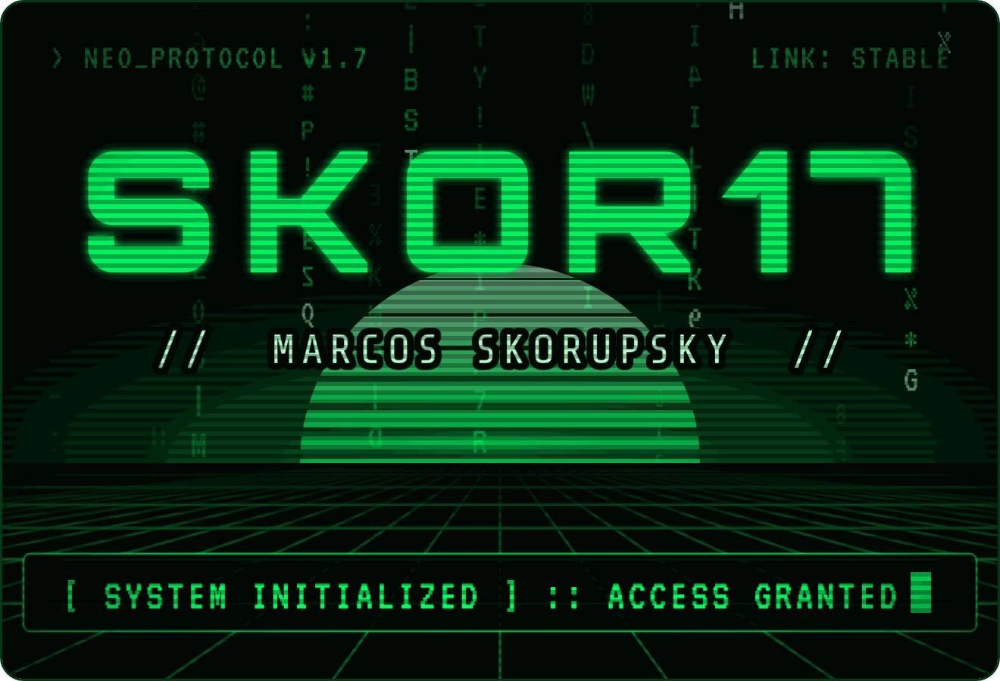
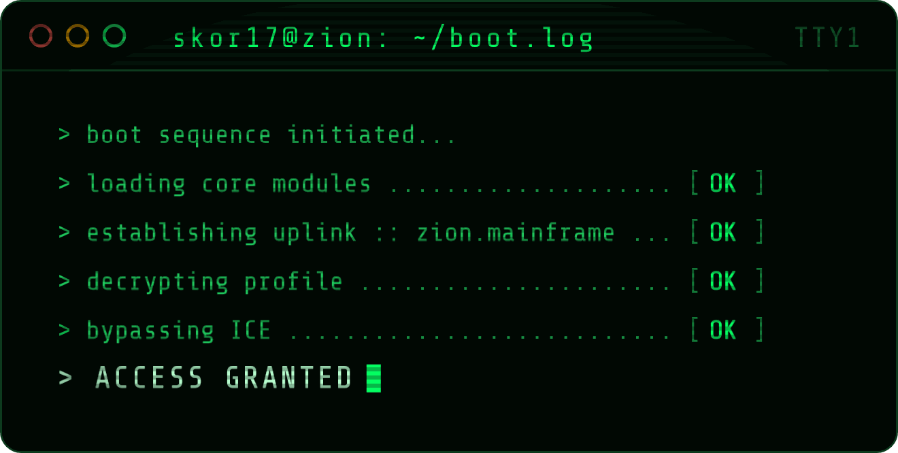
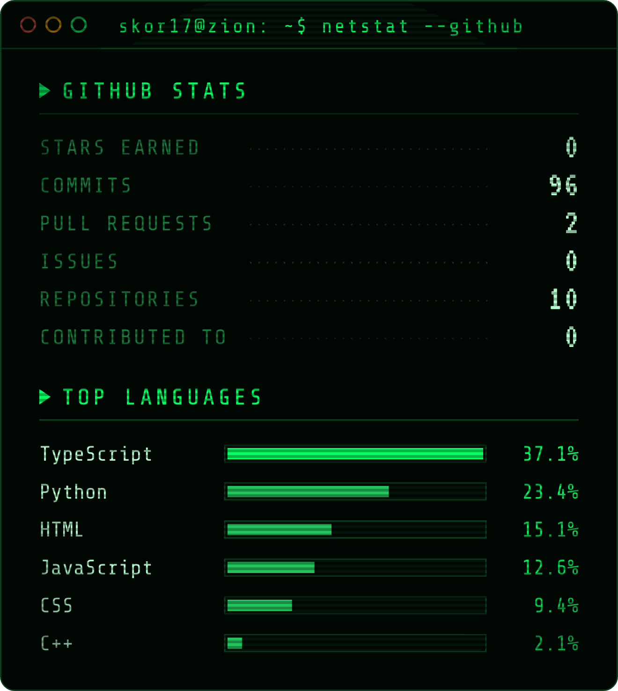
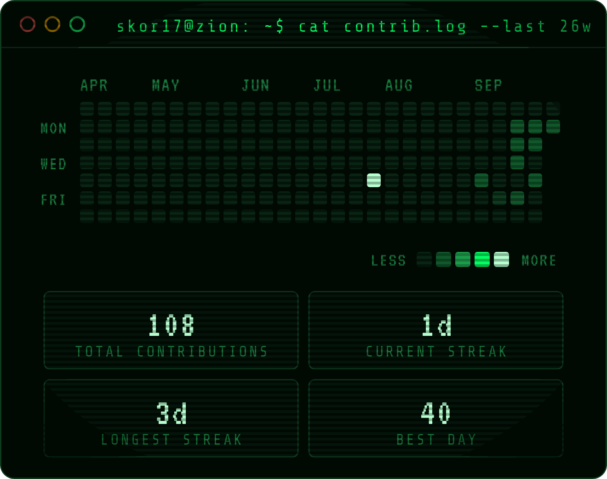
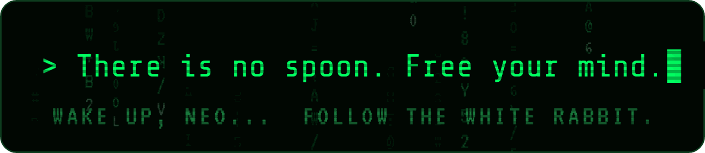

<!--
  Every card is a PNG generated by scripts/build.py from profile.toml: edit
  profile.toml and push, the matrix-sync workflow rebuilds the cards and
  refreshes the GitHub stats every day.

  PNG shows the same in every browser and in the GitHub mobile apps. Phones get
  the stacked layout in assets/mobile/ (also the fallback for any viewer that
  ignores <picture>); screens 640px and wider get assets/desktop/.
  Keep each <picture> block free of blank lines, or GitHub stops treating it as HTML.
-->

<picture>
  <source media="(min-width: 640px)" srcset="https://raw.githubusercontent.com/Skor17/Skor17/main/assets/desktop/header.png" />
  
</picture>

<picture>
  <source media="(min-width: 640px)" srcset="https://raw.githubusercontent.com/Skor17/Skor17/main/assets/desktop/boot.png" />
  
</picture>

<picture>
  <source media="(min-width: 640px)" srcset="https://raw.githubusercontent.com/Skor17/Skor17/main/assets/desktop/whoami.png" />
  
</picture>

<picture>
  <source media="(min-width: 640px)" srcset="https://raw.githubusercontent.com/Skor17/Skor17/main/assets/desktop/stats.png" />
  
</picture>

<picture>
  <source media="(min-width: 640px)" srcset="https://raw.githubusercontent.com/Skor17/Skor17/main/assets/desktop/activity.png" />
  
</picture>

<picture>
  <source media="(min-width: 640px)" srcset="https://raw.githubusercontent.com/Skor17/Skor17/main/assets/desktop/comms.png" />
  
</picture>

<picture>
  <source media="(min-width: 640px)" srcset="https://raw.githubusercontent.com/Skor17/Skor17/main/assets/desktop/stack.png" />
  
</picture>

<picture>
  <source media="(min-width: 640px)" srcset="https://raw.githubusercontent.com/Skor17/Skor17/main/assets/desktop/footer.png" />
  
</picture>

  

