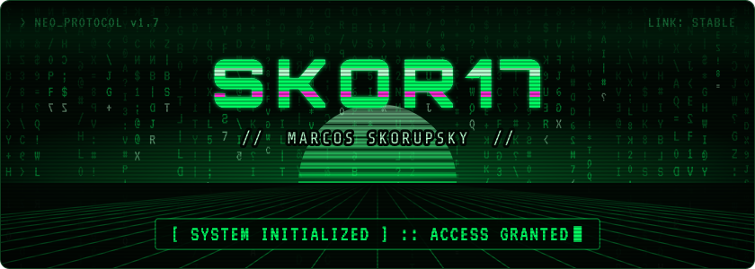
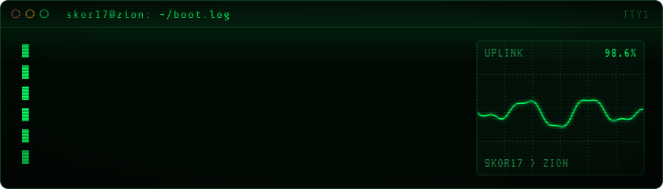
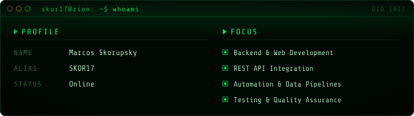
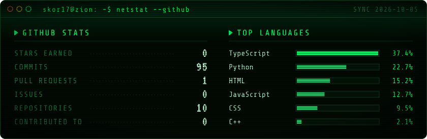
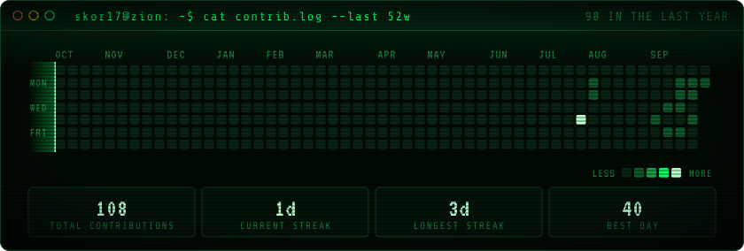
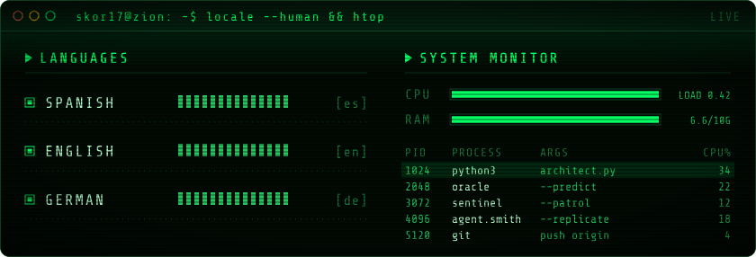
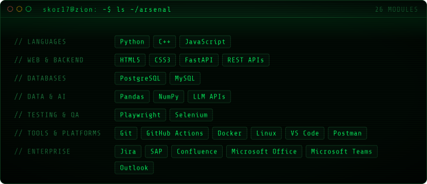
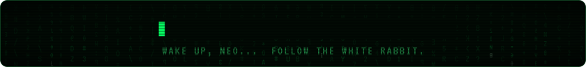

<!--
  Every card below is an SVG generated by scripts/build.py from profile.toml.
  Edit profile.toml, then push: the matrix-sync workflow rebuilds the cards and
  refreshes the GitHub stats every day. Text is drawn as vector outlines, so the
  cards look the same on every OS, browser, light/dark theme and the mobile app.
  Nothing here depends on third-party image services except the visitor badge.
-->

  

  

  

  

  

  

  

  

  

